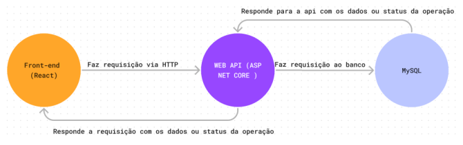

# TIAPC-PUCMINAS

`Sistemas de informação`

`Trabalho Interdisciplinar: Aplicações para Processos de Negócios`

`3° semestre`

O Velozes e Alugados é uma plataforma multilateral projetada no formato de aplicação web para solucionar a alta demanda por aluguel de veículos, agências cadastram os seus veículos e clientes acessam para alugar.

## Integrantes

* Bárbara Xavier Soares de Barros
* Felipe Fernandes de Bellis Ruas
* Higor Antonio da Silva
* Matheus Henrique Marques Canuto
* Rafael Romagnoli Conforte Cesario
* Pedro Arley Paes Maia

## Orientador (a)

* Luciana Mara Freitas Diniz

## Tecnologias, linguagens, ferramentas, serviços e bibliotecas utilizadas

- Figma
- Draw.io
- Visual Studio Code
- Visual Studio
- HTML e CSS
- JavaScript (React)
- Bootstrap
- Asp Net Core (C#)
- MySQL

## Fluxo



## Banco


## Pré-requisitos

Antes de começar, certifique-se de ter as seguintes ferramentas instaladas em sua máquina:

- C# 8.0
- Mysql 8.3.3

## Passos para Inicializar o Projeto

#### 1. Clone o repositório

Abra um terminal e clone o repositório do seu projeto:

```bash
git clone .....
```

#### 2. Configuração do Projeto ASP.NET Core

- Abra o terminal na pasta do projeto da API.

```bash
cd [seucaminho]/...
```

- Instale as dependências do NuGet e configure a string de conexão:

```bash
dotnet restore
```

- No aquivo ConnectionContext.cs dentro da pasta Infraestrutura, modifique a string de conexão com base na sua conexão MySql

```bash
  protected override void OnConfiguring(DbContextOptionsBuilder optionsBuilder)
  {
      string stringConexao = "Server=...;Port=...;Database=...;User Id=...;Password=...;";
  
      optionsBuilder.UseMySql(connectionString: stringConexao, serverVersion: ServerVersion.AutoDetect(stringConexao));
  } 
```

- No banco de dados rode o SQL que está no projeto


- Inicie a API:

```bash
dotnet run
```

A API estará acessível em `https://localhost:7281`.

#### 3. Abra o arquivo index.html
